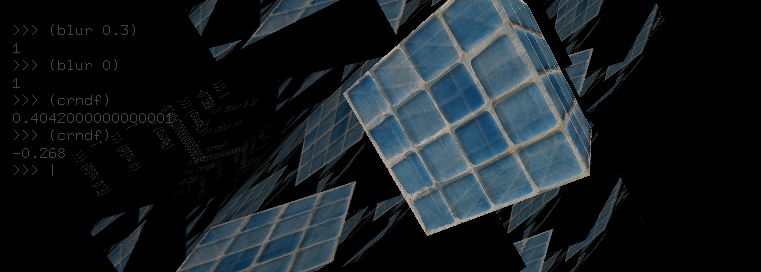

Flowskell - Fluxus clone in Haskell
===================================

Flowskell allows you to write visual animations using the Scheme language. It is inspired by the [fluxus project](http://www.pawfal.org/fluxus/) and driven by OpenGL and the [husk-scheme](https://github.com/justinethier/husk-scheme) interpreter.

Build Flowskell
---------------

    cabal configure
    cabal build
    cabal install

Run Flowskell
-------------

Make sure that the cabal binary path (usually `~/.cabal/bin/`) is in your `$PATH`. You can then simply run a Scheme file from the `examples/` directory like this:

    flowskell examples/donuts.scm

Documentation
-------------

 * [Key bindings](https://github.com/lordi/flowskell/blob/master/doc/keys.md)
 * [Incomplete command reference](https://github.com/lordi/flowskell/blob/master/doc/commands.md)
 * [Examples](https://github.com/lordi/flowskell/tree/master/doc/examples.md)
 * [Bundled shaders](https://github.com/lordi/flowskell/tree/master/doc/shaders.md)
